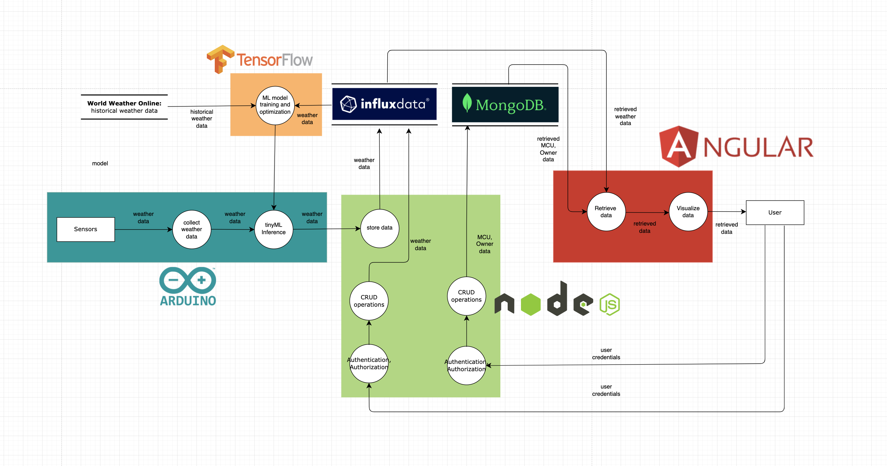

# TinyWeather: Weather prediction on a microcontroller and databse management system

(Work in progress)

## Overview:
The aim is to create a fully functional full-stack data logging and weather prediction system. The system includes implementing tinyML (Tiny Machine Learning)[https://www.datacamp.com/blog/what-is-tinyml-tiny-machine-learning] on Arduino microcrontrollers, storing the weather data in a time-series databse (influxDB) as well as a MongoDB frontend and backend to manage the microcontrollers and their owners. An one-page Angular app provides a user-friendly interface to display real-time weather data, historical data and predictions.

## Key Features:

1. Full-Stack Application:
   - Implement a complete end-to-end solution, starting from the sensors at the Edge of the network to the visual representations of tinyML predictions.
   - Enable seamless data flow and communication between the microcontrollers, databases, and frontend.
2. Machine Learning on Microcontroller:
   - Evaluate and select a suitable machine learning model that can be effectively deployed on microcontrollers for weather prediction.
   - Implement and train the selected model on Arduino microcontrollers to make accurate weather predictions based on sensor data.
3. Serial/BLE Connection with Data Visualization:
   - Establish a serial or Bluetooth Low Energy (BLE) connection between the microcontrollers and the data visualization platform.
   - Develop a data visualization component to display real-time sensor data, enabling users to monitor weather conditions visually.
4. Time-series Database (influxDB):
   - Utilize influxDV as a time-series database to store and access weather data captured by the microcontrollers.
   - Implement real-time updates to enable users to monitor and analyze the latest weather information without delay.
5. One-Page Angular App:
   - Develop a user-friendly Angular frontend application that provides a single-page interface for weather data visualization and predictions.
   - Display real-time weather data, historical data, and visual representations of tinyML predictions in an intuitive and accessible manner.
6. Non-SQL Database (MongoDB):
   - Employ MongoDB as a NoSQL database management system to store information about registered microcontrollers and their owners.
   - Develop backend functionality to handle CRUD operations for managing microcontroller data and user profiles.
7. User Authentication and Authorization:
   - Implement user authentication and authorization mechanisms to secure the system.
   - Allow users to register, log in, and manage their profiles, ensuring appropriate access rights and data privacy.