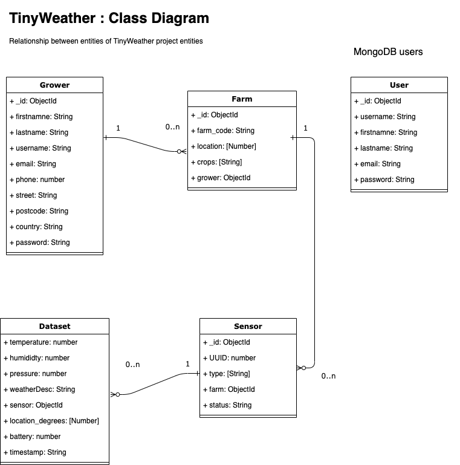

# TinyWeather : Backend

## Overview

This is the server-side component of the TinyWeather platform. It provides an interface to Serial Port for connecting microcntrollers, parses serialized incoming data, stores them in a time-series InfluxDB database as well as provide a RESTful API to visualize and monitor weather data, sensors, farms and growers on a MongoDB database. 
## Swagger Documentation

TinyWeather's API is documented using Swagger. The documentation is available online at [https//localhost:3000/api-docs](https//localhost:3000/api-docs). The documentation provides detailed information about each API endpoint, including request and response formats, authentication requirements, and sample requests and responses.

## Technologies Used

TinyWeather is built using the following technologies:
- Node.js / Express: a webserver that provides the REST endpoints.
- MongoDB: a no-SQL database
- InfluxDB: a high-performance distributed time-series database
- Swagger: a tool for designing, building, and documenting RESTful APIs

## Data Models
Although the entities are stored in a no-SQL database, there is programmed relation between them, with the use of ObjectId as foreign keys.



- Grower: contains information about the grower, including name, contact details, and address.
- Farm: contains information about the farm, including location, crops grown, and a reference to the grower who owns the farm.
- Sensor: contains information about the sensor, including a unique identifier, type, and a reference to the farm where it's located.
- Weather: contains weather data collected by sensors, including temperature, humidity, pressure, weather description, location, battery level, and timestamp.

These data models are related to each other as follows:

- A grower can have multiple farms.
- A farm can have multiple sensors.
- A sensor can report many datasetss.

## Getting Started

This guide assumes you have an account with InfluxDB and MongoDB databases and set up any data models necessary. 

To get started with TinyWeather, you'll need to set up a few things:
Download 

### Download

To download TinyWeather from GitHub, follow these steps:

1. Go to the TinyWeather repository on GitHub: [https://github.com/manokel01/TinyWeather](https://github.com/manokel01/TinyWeather)
2. Click on the "Code" button and select "Download ZIP"
3. Extract the ZIP file to a directory on your computer

### Install Dependencies

Browse to `backend` directory and install the dependencies required to run TinyWeather by running in the terminal:

```
npm install
```
TinyWeather backend has the following dependencies:

- @influxdata/influxdb-client: ^1.33.2
- @influxdata/influxdb-client-apis: ^1.33.2
- bcryptjs: ^2.4.3
- body-parser: ^1.20.2
- cors: ^2.8.5
- dotenv: ^16.0.3
- ejs: ^3.1.9
- express: ^4.18.2
- influx: ^5.9.3
- influxdb-client: ^0.0.1
- jsonwebtoken: ^9.0.0
- lodash: ^4.17.21
- mongoose: ^7.2.1
- mongoose-unique-validator: ^4.0.0
- serialport: ^11.0.0
- swagger: ^0.0.1
- swagger-jsdoc: ^6.2.8
- swagger-ui-express: ^4.6.3
- uuid: ^9.0.0

### Serial Data Collection

To open Serial Port and start collecting data from the arduino browse to `serial.js` file in the `config` directory and edit the serial port parameters to your needs. Then uncomment the relevant snippet in the `server.js` file.

### Run

To run TinyWeather erver, follow these steps:

1. Open terminal and run:
   ```
   node server
   ```
2. Open a web browser and navigate to [http://localhost:3000/api-docs](http://localhost:3000/api-docs) to access the Swagger TinyWeather web interface


