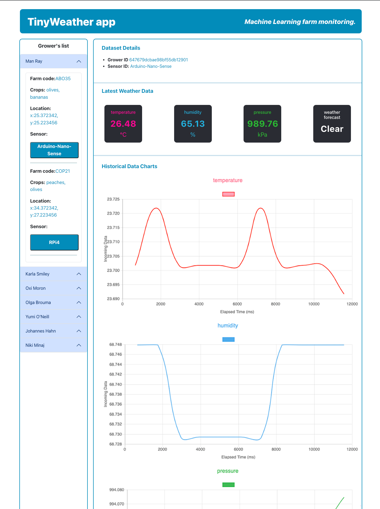

# TinyWeathr Frontend

TinyWeathr is a React web application that displays the weather data, machine learning inference of sensors and lists the database entries from MongoDB and tinyfluxDB. This is the frontend part of the project.

## Features

- View weather data for multiple sensors
- Compare weather data across different time periods in charts
- Filter sensors by grower name or location
- View detailed information about each sensor


## Technologies Used

The TinyWeathr frontend was built using the following technologies:

- React
- JavaScript
- HTML
- CSS

## Dependencies

The TinyWeathr frontend uses the following dependencies:

- `@popperjs/core`
- `axios`
- `bootstrap`
- `chart.js`
- `jquery`
- `popper.js`
- `react`
- `react-bootstrap`
- `react-chartjs-2`
- `react-dom`
- `react-router-dom`

## Installation

The installation assumes you have already downloaded the server of TinyWeather and is running on http://localhost:3000

1. Clone the repository from GitHub:
```
git clone https://github.com/manokel01/tinyweather-frontend.git
```
2. Install the required dependencies:
```
npm install
```
3. Start the server:
```
npm start
```
4. Open the app in your browser at http://localhost:5173.

## Usage

1. Use the search bar to filter sensors by grower name or location.
2. Click on a sensor to display weather data for that sensor.
3. Use the date range picker to select a time period to display weather data for.
4. Use the tabs to switch between different types of weather data (e.g. temperature, humidity, pressure).
5. Use the sensor information panel to view detailed information about the selected sensor.

## Contributing

If you would like to contribute to the TinyWeathr frontend, please follow these steps:

1. Fork the repository.
2. Create a new branch for your changes.
3. Make your changes and test them.
4. Submit a pull request.

## Credits

The TinyWeathr frontend was created by John Smith.

## License

The TinyWeathr frontend is licensed under the MIT License. See the LICENSE file for more information.
