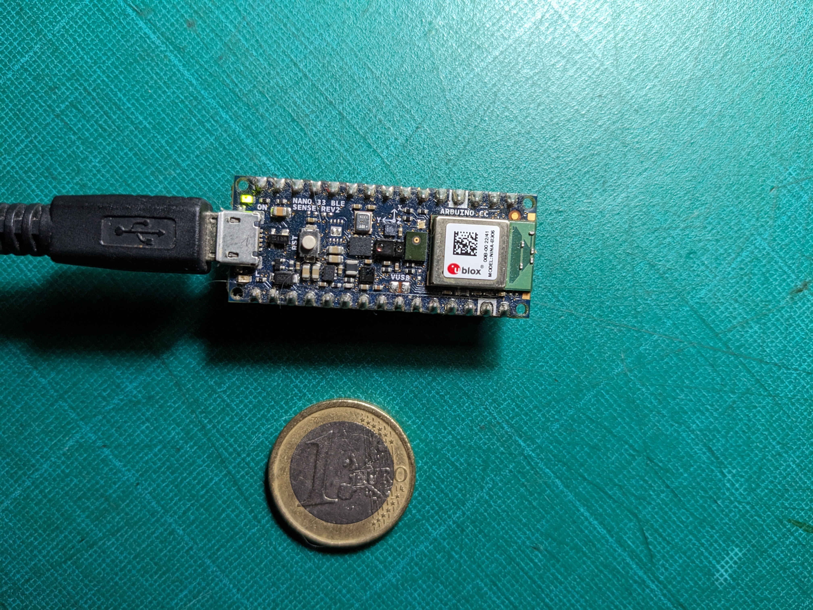

# Data Collection & Machine Learning on Arduino

  

## Overview
tinyML on an Arduino Nano 33 Sense measuring weather data with its sensors and making live weather predictions
using a Dense Neural Netowrk (DNN) model trained with TensorFlow. The data is serialized and send over serial port in JSON format.

Sensors:
- temperature (±0.1°C)/ HS3003 sensor
- humidity (%RH)/ HS3003 sensor
- barometric pressure (260-1260 kPa) / LPS22HB sensor
  
JSON output:
- temperature
- humidity
- pressure
- weather prediction
- device id
- location (x, y coordinates)
- battery levels
- timestamp

## Dependencies:
- ELoquentTinyML.h
- eloquent_tinyml/tensorflow.h
- ArduinoJson.h
- Array.h (The sketch uses a fork of the Arduino Array Library created by Alexander Brevig and updated to work with the more recent versions of Arduino by [Baptiste Zioch](https://github.com/BaptisteZloch).
Make sure to include your trained and converted with TFLite model file in the same folder as your Arduino sketch.

 ## Installation

After creating the model and converting with TensorFLow Lite copy the file ("model.h) in same directory as the Arduino sketch.

Upload sketch (.ino file) to the Arduino using the Arduino IDE.

